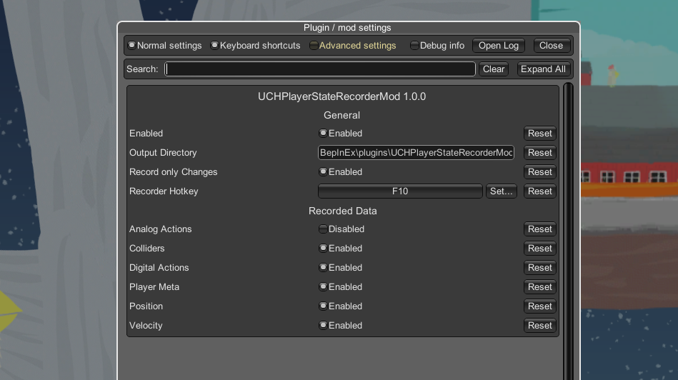

# UCH PlayerState Recorder

This mod enables recording of the PlayerStates for each frame. This is intended to analyse the games behavior.

## Requirements

[BepInEx 5](https://github.com/BepInEx/BepInEx/releases) is required to run this mod.

## Configuration Options

The user can select what data should be logged via configurations.
Configs can either be changed in the configs directory at <your-steam-folder>\Ultimate Chicken Horse\BepInEx\config\UCHPlayerStateRecorderMod.cfg (this file gets only created after the game was launched once with the mod).
Alternatively you also install the [ConfigurationManager](https://github.com/BepInEx/BepInEx.ConfigurationManager) which enables this neat UI to change configs ingame:

### General Configurations
|ConfigName|Description|Default Value|
|----|----|----|
|Enabled|Enables/Disables this mod|true|
|Record only Changes|Records only data if anything changed|true|
|Recorder Hotkey|The Hotkey to start and stop recordings|F10|
|Output Directory|The directory where recordings should be stored|\<ModDirectory>\Recordings|

### Recording Options
|ConfigName|Description|Default Value|
|----|----|----|
|Position|Records the Player Position at each frame|true|
|Velocity|Records the Player Velocity at each frame|true|
|Digital Actions|Records the Players current registered digital inputs|true|
|Analog Actions|Records the Players current registered analog inputs|false|
|Colliders|Records the Players top, bottom, left and right colliders which indicate if the player collides with any object at that side|false|
|Player Meta|Records the additional meta data from the player like OnGround, OnWall, CanJump and others|false|

## Example Recording
